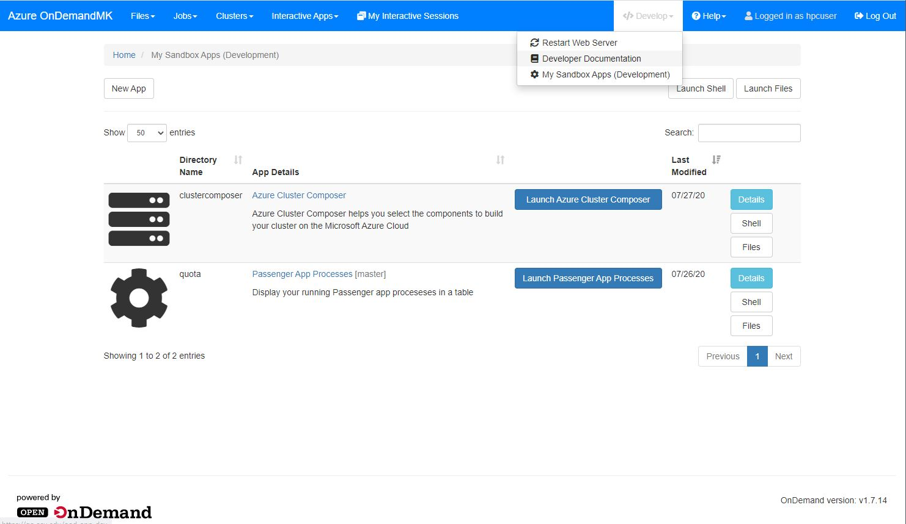
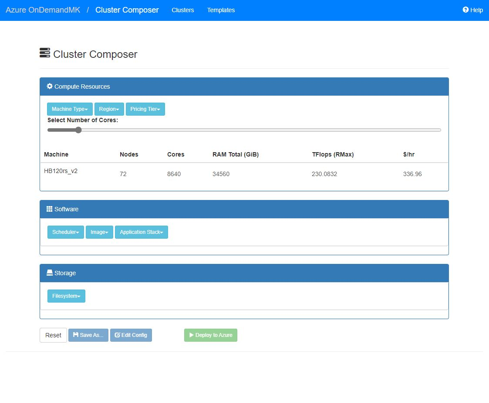

# Azure Cluster Composer OOD Application #

Experimental RoR scaffold+mock-up application to configure & deploy clusters with azhpc and register them with OnDemand. 

## Setup Instructions ##

Cluster Composer is provided as a user application - you'll need to enable <a href="https://osc.github.io/ood-documentation/master/app-development.html">App Development</a> in your OOD deployment, then git clone this repo into /share/home/hpcuser and create an ondemand/dev folder with a softlink as follows: 

```
[hpcuser@ood ~]$ cd /share/home/hpcuser/ondemand/dev
[hpcuser@ood dev]$ ln -s /share/home/hpcuser/Azure-OnDemand/apps/clustercomposer clustercomposer
[hpcuser@ood dev]$ ls -la
total 0
drwxrwxr-x. 3 hpcuser hpcuser  42 Jul 27 09:35 .
drwxr-xr-x. 4 hpcuser hpcuser  29 Jul 26 15:27 ..
lrwxrwxrwx. 1 hpcuser hpcuser  55 Jul 27 09:31 clustercomposer -> /share/home/hpcuser/Azure-OnDemand/apps/clustercomposer
```
At this point you should see the "Develop" icon on the menu bar. Click on Develop->My SandBox Apps (Development) and you'll see the Cluster Composer application which you can launch with the launch button: 

<br>
 
<br>

Once launched, you'll see the Cluster Summary view, then click on the "Create New Cluster" to launch the Cluster Composer tool as below. The purpose of the tool is to generate or customize an azhpc config.json file, launch the cluster and then register it with OOD. Clusters can be static or autoscaling, time-limited or persistent. 

<br>
 
<br>
